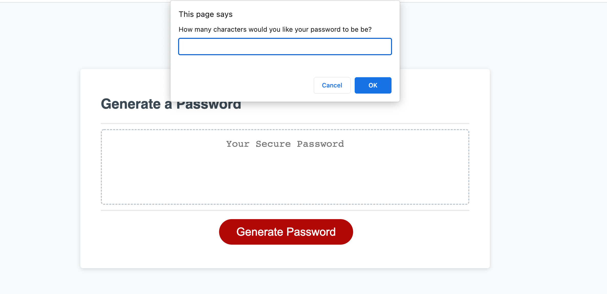

# Password Generator Starter Code

## Description

The purpose of this project is to use JavaScript to compose a password generator that generates a password based on the following acceptance criteria:

```
GIVEN I need a new, secure password
WHEN I click the button to generate a password
THEN I am presented with a series of prompts for password criteria
WHEN prompted for password criteria
THEN I select which criteria to include in the password
WHEN prompted for the length of the password
THEN I choose a length of at least 8 characters and no more than 128 characters
WHEN asked for character types to include in the password
THEN I confirm whether or not to include lowercase, uppercase, numeric, and/or special characters
WHEN I answer each prompt
THEN my input should be validated and at least one character type should be selected
WHEN all prompts are answered
THEN a password is generated that matches the selected criteria
WHEN the password is generated
THEN the password is either displayed in an alert or written to the page
```

When working on the project, I faced a few roadblocks which resulted in me getting a better understanding of JavaScript concepts. I struggled with declaring variables for the function, initiating the prompt on the click of the button, and factoring an effective function and loop.

I've learned the importance of utilizing local and global variables properly. I stored the characters in an array under global variables since the items in the array were not changing. For variables that are manipulated within the function, such as "createdPassword" and the prompts, I've store locally within the "generatePassword" function. 

I noticed how arrays are stored and little details like capitalization created errors that prevented the prompts to pop up. As I worked through the code, I've learned to take it one step at a time to develop the function and pay close attention to the details. 

When coding the function, I tried to create a large conditional statement as users worked through each prompt. However, with the help of some tutoring, I've learned that I can create multiple if statements for each character condition. This allowed a straightforward method for adding each character's array to a new container array if selected, and then creating a for loop to randomize characters within the container array base on user's preferences.

Overall, I've gained a better understanding of variables, functions, and loops. I've also learned that it's effective to start simple with the fundamentals and break the code out in pieces instead of complicated the code. 

Here is the deployed site of the [Password Generator](https://kassing3.github.io/Module3-Challeng-Password-Generator/) to view. 


## Usage

To initialize the password generator, the user will click the "Generate Password" button. A series of prompts will pop up in the window to ask the user to input the number of characters they want for the password, and confirm whether they want lowercase, uppercase, numeric, and special characters. Once confirmed, a generated password will appear on the site based on what the user selected.

 

## Credits

I want to extend a huge thank you, and credits to my TA and tutor for helping me gain a better understanding of concepts that allowed me to refactor the code.
